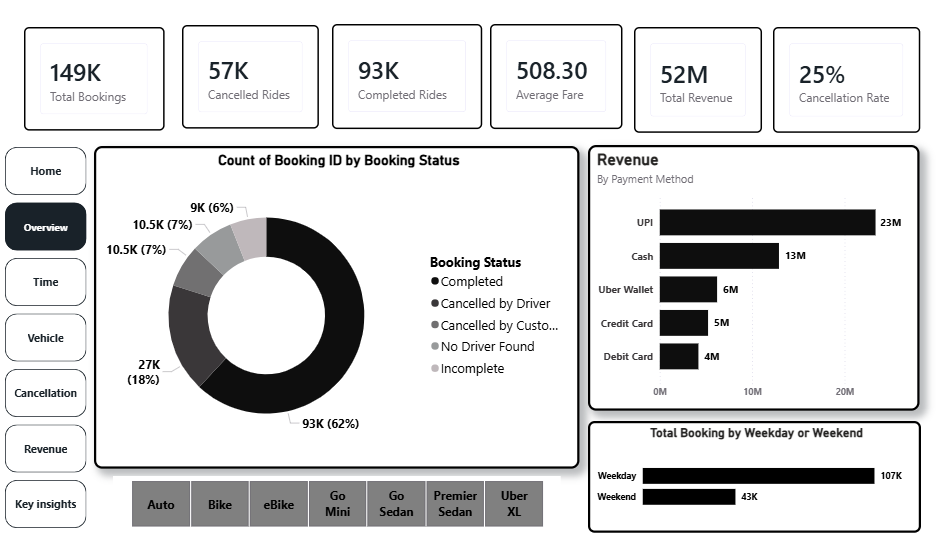
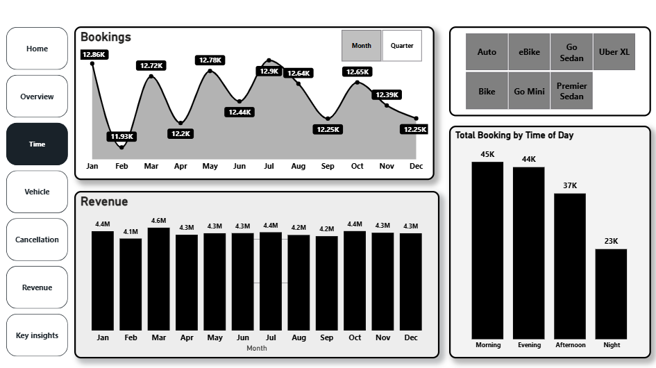
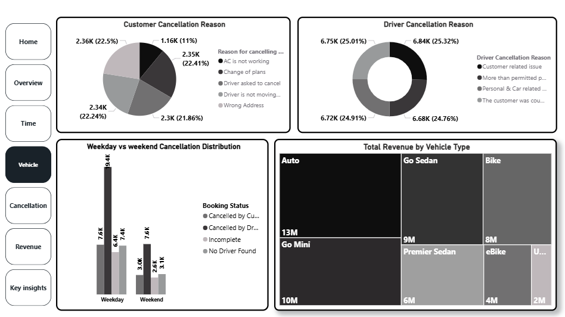

# 📊 Uber Ride Booking & Cancellation Analysis – NCR

# 📌 Project Overview

This project analyzes Uber ride booking data from the NCR region to identify booking trends, revenue patterns, and cancellation behaviors using Power BI.

Dataset Source: Kaggle

# 🎯 Objectives

• Analyze total bookings & revenue

• Study time-based demand patterns

• Compare weekday vs weekend rides

• Identify cancellation reasons

• Detect driver shortage hotspots

# 📈 Dashboard Features

• KPI Cards (Bookings, Revenue, Cancellation Rate)

• Time Trend Analysis

• Revenue by Payment Method

• Vehicle Type Performance

• Cancellation Reason Analysis

• Driver vs Customer Cancellation Impact

• Top Pickup Locations with No Driver Found

# 🛠 Tools Used
 
• Power BI

• DAX

• Data Modeling

• Data Visualization

## 🔍 Key Findings

• Evening time slot recorded the highest bookings.

• UPI was the most preferred payment method.

• Cancellation rate stood at ~25%.

• “No Driver Found” was highest in specific pickup hotspots.

• Weekdays had more ride demand than weekends.

## ▶️ How to Use

1. Download the `.pbix` file.
2. Open in Microsoft Power BI Desktop.
3. Load dataset if prompted.
4. Interact using slicers and filters.

# 📂 Dataset

NCR Uber ride dataset downloaded from Kaggle.

## 📸 Dashboard Preview

### Overview Dashboard

### Time Analysis

### Vehicle Analysis

